## 《批判性思维工具》（《Critical Thinking》）读书笔记

[TOC]

### 第一章 究竟什么是批判性思维

- 穿肥裤子从警察面前逃跑，人们都认为这并非“批判性思维”，但从逃跑者的角度，为什么他会这样做？
- 一种思维……、**另一种**思维……

- 为什么进行批判性思维
  - 我们进行……，**是为了考量我们自己（或他人）的思维是否符合逻辑，是否符合好的标准**
  - 我们的思想可能不像自己想当然的那样清晰明白
  - 他人的评估与自己的反思
- 如何构建批判性思维
  - **好论证的最低标准**
  - **不利于构建好论证的诸多干扰因素**
  - 如何识别**形成结论的常见误区**
  - 学生是否善于：
    - 区别事实和观点
    - 洞察他人论证的陷阱与漏洞
    - 处理矛盾的、不充分的、模糊的信息
    - 基于数据而不是观点建立令人信服的论证
    - 知道问题往往没有明确答案和唯一解决办法
    - 提出替代方案
    - 采取行动时考虑所有**利益相关的主体**
    - ……
    - ……

#### 1.1 信念和断言

> 得出结论=形成信念

- 如果你得出结论：电池没电了，**你就会相信电池没电了**

- 信念=观点=判断

	### 1.1.1客观断言和主观断言

- 客观断言：其真假不依赖于人怎么想
- 主观断言：其真假依赖于人怎么想，或者说其真假意义不大，人们可以各执己见
- “80%的人认为奥巴马很酷”
- “奥巴马很酷”

####  1.1.2事实与观点

> 并非所有的观点都是主观的，如关于事实的观点是客观的

- “我曾经相信……”

#### 1.1.3道德主观主义

> - 虐杀驴子的十岁男孩
> - 用石头砸死通奸妇女的群众

- 斗牛是否错了呢？（任何事物都是完全辩证的么？）
- 作者的观点倾向：大部分道德哲学家拒绝认为道德是纯粹主观的[^道德存在客观正确吗？][^存在真正的客观吗？]

[^道德存在客观正确吗？]:是吗，真的是这样吗？我认为作者其本意还是劝人向善的。他试图说服读者“道德具有其客观正确性”。但其说服方式一方面是使用现代人普世的道德标准（虐杀驴子的例子）博取读者的认同（读者的认同是主观的）；另一方面是使用“大多数道德哲学家”的观点为自己站台（但道德哲学家的观点无非也是主观的）。作者试图用主观的普适性代替客观正确性，借此证明“道德具有客观正确性”。这是正确的吗？
[^存在真正的客观吗？]:又或许这世上的“客观”，无非就是“普适的，为大多数人接受的主观”？

### 1.2论题

> 摩尔比帕克高吗？

- 冠冕堂皇的废话[^我们为什么说废话？]

[^我们为什么说废话？]:	现实生活中，冠冕堂皇的废话为什么被普遍的使用？或许原因之一是它逃避了论题？

- 如果我们不知道**一个论题到底是什么**
  - 就无从评价支持或反驳该论题的论证
  - 也无法进一步解决关于论题的争议
- 一些不明论题的问题案例
  - 别的<u>空间</u>上是否生活着和你一模一样的人？
  - 向往<u>自由</u>是人的本性
- 一些不容易通过实验方式求解的问题
  - 道德论题、数学难题、历史问题、重大哲学疑难、法律问题、**美学问题**
- 到底哪些因素于问题的答案有关？

### 1.3论证

- 论证：前提+结论
- 前提：我爱……，我能照顾……，我找不到拒绝接受它的理由
- 结论：我应该领养……
- 批判性思维：反省上述推理，并对之进行评估

### 1.4认知偏差

> 影响清晰思考的心理因素

- 信念偏差
  - ~~得出此观点的推论是否符合逻辑~~
  - 我是否赞同这个观点
    - 例如限制强制或非法移民
- 可得性启发
  - 管中窥豹，以小见大？
  - 佚事概括
- 错误共识效应
  - 大家也一定都是这样想的
- 从众效应
  - ~~大部分人都支持我！~~
  - 大家都支持我！
- 消极偏见
  - ~~大家都支持我！~~
  - 没有人会支持……的！
  - 损失规避
- 圈内偏见
  - 人与人之间不需要多少共同点就能构建一个组群的身份归属感
    - 竞争关系
  - 大多数情况下，人们对于一个人是圈内还是圈外的判断很武断
  - 基本归因错误
    - 天公不作美！我失败了！
    - ……不够勤奋，活该失败！
- 盲从权威
- 锚定效应
- 过度自信效应（属于自我欺骗偏见）
  - 高于平均水平的错觉
  - **过度自信的认为自己更少的受过度自信效应的影响**

*形成信念的过程中，心理和本能起到的作用和客观证据起到的作用旗鼓相当*

*我们都带着有色眼镜看待问题*

### 1.5“真”和“知识”

> 桌上有本书，这是真的

- “完全知道”某件事，是不存在的
- 贸然相信是不明智的

### 1.6批判性思维能做的和不能做的

- “批判性思维”不是
  - “好思维”
  - “艰难的思维”
  - “清晰的思维“
  - “构建论证”
  - “解决问题”
- 针对思考过程进行评估
- 帮助你识别不好的理由
- 避免思维受到认知偏见的约束

## 第二章 两类推理

> 深入讨论论证

### 2.1论证的基本特征

- 上帝存在

  - 就像万物生长靠太阳一样清楚明白
  - 不信这一点的人将下地狱
  - 因为我是基督徒

  **都不是论证**

- 上帝存在，因为宇宙有其产生的原因

  **是论证**[^上帝存在，因为宇宙有其产生的原因，这是个好论证吗？]

[^上帝存在，因为宇宙有其产生的原因，这是个好论证吗？]:1.宇宙的产生是一个不明确的概念2.没有证据证明宇宙产生是有原因的

#### 2.1.1结论做前提

- *结论$\rightarrow$结论* 的推理链（图结构）
- 滥求某一结论的根是不现实的
- 结论指示词
  - 于是……
  - 结果……
  - 所以……
  - 这表明……
  - 这蕴含……
  - 这显示……
  - 这证明……

#### 2.1.2未表达的前提和结论

- 只有从群众出发才能领导群众，共产党从群众出发
- 这辆车没法修理了，丢掉它吧（没法修理的汽车要丢掉）

### 2.2两种论证

> - 演绎论证
> - 非演绎论证

#### 2.2.1演绎论证

> 前提证明结论
>
> *前提为真$\rightarrow$结论为真*

- 有效论证（Valid）

  满足

  - 前提为真时
  - 结论不可能为假

  *爸爸的爸爸是爷爷，我爸的爸爸是我爷爷*
- 可靠论证（Sound）

  - 前提为真的有效论证

#### 2.2.1非演绎论证

> 前提~~证明~~支持结论

- 好论证和坏论证
- 林肯的三段论

#### 2.2.3排除合理怀疑

> 除非证据能排除合理怀疑的**证明犯罪**，否则宣告无罪

### 2.3演绎，非演绎和未表达前提

- 未表达前提

  - 挂起了南风，天要下雨

    （附近地区，南风过境总会引起下雨）

- 上下文和语境能帮助我们理解未表达前提是什么，以明白

  - 说话者究竟在做演绎论证还是非演绎论证
  - 说话者究竟在做好论证还是坏论证

- 补充的未表达前提应当是可信的

### 2.4“衡平推理”和“最佳解释推理”

- 衡平推理
  - 权衡利弊的推理
  - 既包含演绎成分，也包含非演绎成分
- 最佳解释推理
  - 溯因推理
  - 非演绎推理
  - 物种为什么多样，其最佳解释是“达尔文进化论”
  - 物种为什么多样，其最佳解释是“上帝创造生命”
- 最佳解释应当
  - 最充分的解释该现象
  - 能做出最准确的预测
  - 与其他已被接受的解释冲突最少
  - 需要最少的不必要的前提和假设

### 2.5哪些表达不是前提、结论或论证

#### 2.5.1图像

> 电影是真的吗？

- 任何不能以“真”、“假”衡量的表达都不能作为前提或者结论

- 情感、感受、风景、神态、姿势、贿赂、威胁、娱乐、说唱……

#### 2.5.2“如果……那么……”所连接的句子

> 如果没有迪亚特洛夫的专横武断，就没有切诺贝利的爆炸
>
> - 可以作为结论
> - 其前提是迪亚特洛夫专横武断导致切诺贝利爆炸

#### 2.5.3对事实的罗列

- ~~身份信息的失窃较上一年增多了至少十倍。越来越多的人学会了如何窃取他人信息。警方提醒您保管好个人信息~~
- 越来越多的人学会了如何窃取他人信息。所以相比以往人们更加容易成为信息泄露的受害者

#### 2.5.4A，因为B

- ~~麦克穿着泳衣，因为他刚游完泳~~
- 麦克刚游完泳，因为他穿着泳衣

- “因为”到底引出的是解释、还是证据

### 2.6道德、情感、逻辑

- 逻辑是最难起效的说服方法[^以逻辑服人]
- 演绎论证是否可靠，丝毫并不决定于人们是否真的被它说服了
- 说服他人的手段
  - 人类常常对有理有据的观点保持中立而对最差的论证引起共鸣
  - 试试洗脑式的宣传吧
  - 阿谀奉承也是已知的手段
- 作者的妥协：“以情服人”的表达$\rightarrow$剥离出“以理服人”的部分$\rightarrow$重新审视其理是否足够让人信服

[^以逻辑服人]:作者直接给出了“逻辑难以服人”的结论，却难以让人辩驳。说服他人如此重要、利害相关。不要做一个执着于以逻辑服人的理想主义者

### 2.7理解论证的技术

- 为了评估论证，首先应理解论证
  - 发现结论
  - 找出理由
  - 发现针对前提的论证
  - 理解论证的结构

#### 2.7.1澄清论证的结构

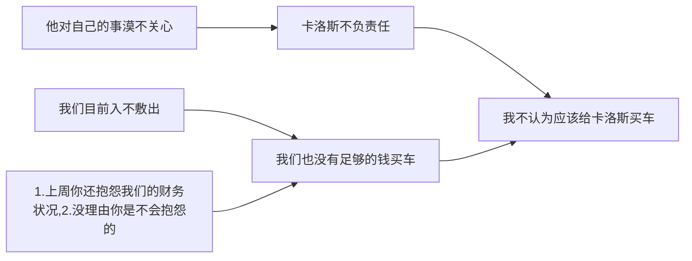

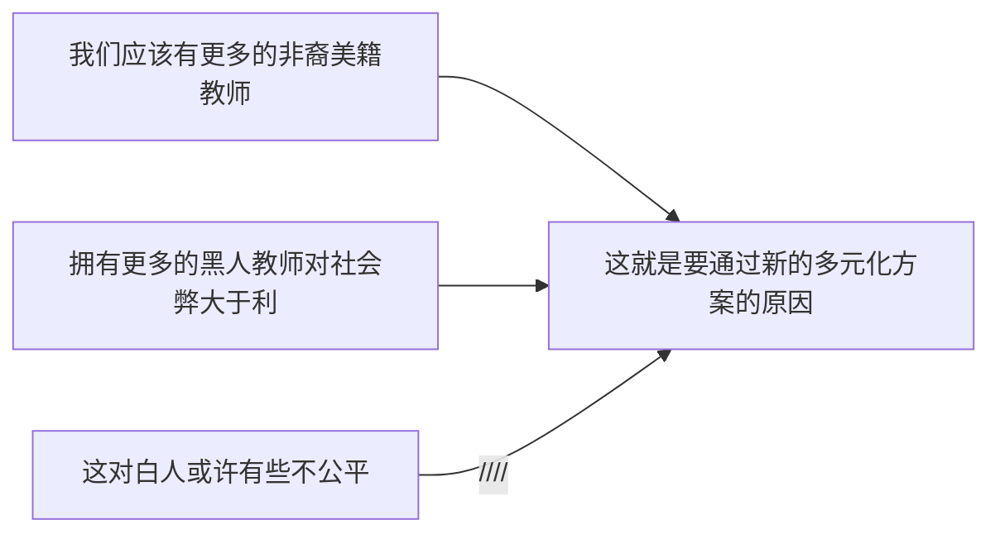

#### 2.7.2通过装饰性的表达识别论证

- 区别论证和修辞

### 2.8评估论证

> - 逻辑
> - 真假

- 到底是在论证还是在支持其结论？
- 论证的前提确实为真吗？
  - 避免落入修辞或心理的误区

## 第三章 清晰的思维、批判性思维与清晰的写作

- 导致表达含混的原因
  - 过度模糊
  - 歧义
  - 过度抽象
  - 未界定术语
- 优秀论文的四部构成
  - 陈述论题
  - 表明对论题所持立场
  - 提供支持立场的论证
  - 对支持相反立场的论证展开反驳

### 3.1模糊

- 边界模糊
  - “秃顶”（多少头发算秃）
  - “酷刑”（水刑算不算酷刑）
  - “鲁莽驾驶”（什么情境下算“鲁莽”）
  - “大十字路口”（多大算大？）
  - 提高对“富人”的征税（多富算富人？）
- 模糊可以接受的程度
  - 使人理解其中的断言（断言表达有用的信息）

### 3.2歧义

- ~~为什么~~是什么推理让你不支持同性恋结婚？
- “权利”不同意义引来的争议性
  - 歧视性的同性恋法律？
  - 规定“特权”的同性恋法律?
  - **界定关键术语的准确意义**

#### 3.2.1语义歧义

- Jessica is ~~cold~~
- Aunt Delia never used ~~glasses~~

#### 3.2.2组合歧义

> - 割草机比越野摩托制造的噪音更多（总量更多）
> - 历史上增幅最高的增税（总量更高）

- 分解谬误

  ~~群体特征$=$群体成员特征~~

  - 金州勇士队是联盟最好的队伍$\not=$库里是联盟最好的球员

- 合成谬误

  - 每一事物组成的宇宙未必有其形成原因

    前提：每一事物都是有其形成原因的

    所以：~~宇宙也是有其形成原因的~~

    所以：上帝存在，它是宇宙形成的原因

  - 国王队难以战胜湖人队，湖人每个位置的队员都强于国王队

#### 3.2.3语形歧义

- 介绍一个不具备竞争力的朋友又不愿意信口开河
  - 在我看来，~~有他为你工作你会感到幸运~~
  - 很高兴告诉你，~~这个人是我以前的同事~~

### 3.3抽象

- 随意的使用词语
  - “战争”
  - 摩尔有只“宠物”（狗）
  - 解决方式：使用**定义**

### 3.4定义术语

#### 3.4.1定义的目的

- 告知词语的通常意义
- 约定词语的特定语境下的意义
- 减轻模糊、抽象或消除歧义
- **用于说服**
  - 说服定义或修辞定义
  - 定义者本身就站在一定的立场上
  - 包含着对所指对象的正面评价和负面评价

#### 3.4.2定义的种类

- 列举定义

  - 圣典：圣经、古兰经、……

- 同义词定义

  - 吹毛求疵：挑刺

- 分析定义

  - 俄式茶壶是俄罗斯人用于……的茶壶

  ### 3.4.3定义的注意事项

  - 不自带立场，使得辩论的某一方处于不利境地
    
    - 例如“人民”的定义相对于“公民”就自带立场
  - 定义必须是清晰的
  
  - 用于澄清分析而非混淆视听
  
  - “友谊”、“公平”、“忠诚”、“自由”、“权利”

    **不追求其最终定义，提供援引即可**

  - 人生而~~自私~~
  
  # 3.5论文写作

好论文的标准：

1. 中心突出
2. 紧扣主题
3. 按照逻辑顺序谋篇布局
4. 结构完整

#### 3.5.1练习写作

1. 组织材料，列出写作提纲
2. 修改你的作品
3. 寻求其他人读完你文章后的意见
4. 大声朗读以发现文法问题
5. 搁置一段时间，隔段时间后进一步修改

- 写作的时候应当
  1. 避免陈词滥调
  2. 尽量具体
  3. 不要抽象
  4. 避免被动句式
  5. 不要啰嗦
  6. 谨慎陈述而非夸大其实
  7. 保证主谓一致
  8. 运用修辞手段
  9. 插入评论是非必须的
  10. 仔细核对每一个字
  11. 句首不应用连词

#### 3.5.2论文写作的常见误区

1. 废话连篇
2. 信马由缰
3. 未经思考
4. 不得要领
5. 让读者体会

#### 3.5.3有说服力的写作

1. 集中讨论与对手论题产生的分歧而非关注个人观点
2. 不以攻击语言反驳对手
3. 坦率承认对手的好论证
4. 将论证注意力集中在主要环节
5. 先陈述强有力的论证

#### 3.5.4多元化社会中的写作

- 性别、种族背景、性取向、体能、残疾
- 不精确、不准确、怀有偏见、降低可信度

## 第四章 可信性

- 断言

  这是XX银行的邮件，XX先生，请您提供您的账号和密码用于……

- 断言之来源

### 4.1断言之来源

- 可信度
  - （增加、失去）
  - 我喜爱的女孩因为抢劫银行被捕
  - 我喜爱的女孩有一支自动手枪

### 4.2评估断言的内容

- 有些断言不证自立
- 有些断言让人生疑

#### 4.2.1断言与我们的个人观察相冲突吗？

> - 我看到百度上架了医疗广告
> - 朋友告诉我百度正在整治不法医疗广告
> - 我立刻反驳朋友这不可能
> - ……

- 观察或近期记忆并非不可错

- 一厢情愿的思维

  - 任由希望和愿望影响我们的判断、粉饰我们的信念
  - 个人兴趣和偏见会影响我们对事物的认知和判断

- 不可信，但真实

  [Roger N. Shepard](https://en.wikipedia.org/wiki/Roger_N._Shepard)Table

#### 4.2.2断言与我们的背景信息相冲突吗？

- 背景信息：大量已被证明的信念[^背景信息包不包括不被证明的信念？]

[^背景信息包不包括不被证明的信念？]:如果某个信念并非是被证明的、但只是被身边大量的人所信服、那么它算不算背景信息？如何区分我已经形成的信念被不被证明？

- 初信度（initial plausibility）
  - 首次面对一个断言时，赋予该断言一个特定的“初信度”
- 考量与背景信息相冲突的断言
- 信任你的背景信息
- 保持开放的头脑，意识到背景信息失去可信度的可能

- 你的背景信息越广、越能胜任对给定报告的评价
  - 广泛阅读
  - 自由交流
  - 培养研究的态度

### 4.3评估信息来源的可信性

> 人们往往不会听信原配偶的建议

#### 4.3.1利益相关方

> 评估信息来源的首要准则

- 发布信息者与其所提供的信息是否利益相关？

  2004年，“专家”：让财富保值避免通货膨胀的有效手段就是购买黄金、	

  4S店：您的汽车漏油

- 时刻警惕利益相关方

#### 4.3.2体貌以及其他特征

- 眼神对视、冒汗、哂笑、声音洪亮……
- 性别、年龄、种族、口音、举止……

#### 4.3.3专业性

- 质疑是否具备关于争议问题的知识
- 教育和经验
  
- 误区：经验并不指时间长短
  
- 成就和声誉

- ~~一个领域的专家理所当然的是其他领域的专家~~

- 有时候，听取专家的意见是至关重要的

  *[切尔诺贝利事件](<https://en.wikipedia.org/wiki/Chernobyl_disaster>)*

### 4.4可信性与新闻媒体

> 对于7家印刷媒体，19%民众“都相信或总体相信”其报道的内容

#### 4.4.1媒体所有权的合并

- 媒体受控于越来越少的几家公司

- 媒体越控制在少数人手中，我们越容易得到被“操纵”的信息

  [怎样看待腾讯泛娱乐的概念？ - 知乎](https://www.zhihu.com/question/30134640)

- 有导向的信息

#### 4.4.2政府对信息的操纵

- 药物、安全、医疗……
- ~~批评意见~~
- 精心包装的榜样

#### 4.4.3媒体的偏见

- 媒体有政治倾向$\checkmark$
- 主流媒体及杂志面临压力
- 谨慎对待符合我们偏好的结论
- 为了争夺观众注意力，娱乐议题比严肃议题更容易获得成功
- 作者的建议
  1. 新闻媒体工作人也会犯错，忽略审查信息的来源
  2. 媒体也会承受压力，收到外界力量的操纵
  3. 媒体受利益驱动
  4. 媒体往往是社会的折射

#### 4.4.4电视访谈节目

- 各执己见（偏见）
- 强调对于事实加以选择和报道

#### 4.4.5电视辩论节目

- 片面强化观众的信念
- 面对政治新闻时应当更加审慎
- 特别是你本来倾向于支持的观点

#### 4.4.6互联网

- 评估互联网信息，应当比审查来自印刷媒体、广播和电视信息时**更为谨慎**

- 互联网信息来源

  - 商业来源和机构来源

    *信息库*

  - 个人网站和团体网站

    *优质信息、娱乐、广告、诱惑、欺诈、谎言*

- 来自专业人士的提示：

  - 忽视视觉效果对人的左右

    *一个虚假的钓鱼网站往往看上去很正规*

  - 信息库中的信息更广泛、但信息发布者处的信息更为准确和正规

  - wiki条目之间的质量存在天壤之别

    - 从该渠道获取的信息需要进一步验证

  - **验证**

    - [Snopes.com](<https://www.snopes.com/>)专业的验证流言与逸闻的网站
    - [TruthorFiction.com](<https://www.truthorfiction.com/>)
    - [Factcheck.org](<https://www.factcheck.org/>)
    - [PolitiFact.com](<https://www.politifact.com/>)

  - **人们往往会舒坦的听信谣言、拒绝与他们相左的意见**

### 4.5广告

> 广告是尽力抑制人类智力以便从中牟利的科学——Stephen Leacock

- 提供理由的广告
  - 实现……满足……消除……价格为人接受……你能更……
- 不提供理由的广告
  - 触动人情的广告
  - 描述产品正在被我们崇拜的人或同一个圈子的人使用或支持的广告
  - 描述该产品的使用环境正是我们希望置身于的环境
- 植入广告
- 广告为何臭名昭著
  - 模糊性、模棱两可
  - 误导
  - 夸张
- 语言
  - 好的难以置信
  - 轻松
- ~~仅凭广告来购物~~

## 第五章 常见修辞技巧

> 修辞影响人的心理，但它本身并不能确证什么
>
> ……我们必须能够识别评论的逻辑力量与心理力量之间的不同

| 修辞手段                 | 修辞的隐藏目的                                 |
| ------------------------ | :--------------------------------------------- |
| 委婉语                   | 隐瞒负面因素                                   |
| 粗直语                   | 强调负面因素                                   |
| 闪烁其词                 | 弱化表达以规避批评                             |
| 贬抑                     | 降低事情的重要性                               |
| 刻板印象                 | 无正当理由的过于简单的概括一类对象中的每个成员 |
| 暗示                     | 运用中立甚至积极的语言暗示人们联想事情的反面   |
| 加载问题                 | 依赖于没有正当理由的假设                       |
| 嘲讽                     | 营造尴尬境地                                   |
| 夸张                     | 过分夸大                                       |
| 修辞性定义、解释         | 激发带有倾向性（积极、消极）的态度             |
| 修辞类比和令人误解的比较 | 建立事物间不恰当的联系来说服                   |
| 替代证明                 | 只提示有证据和依据但不说明其具体来源           |
| 重复                     | 不断出现以错误的增加我们的                     |

### 5.1修辞技巧

#### 5.1.1委婉语和粗直语

- 委婉语
  - 旧车$\rightarrow$二手车

  - 游击队员$\rightarrow$自由战士

- 粗直语

  - 游击队员$\rightarrow$恐怖分子

  - 增加税收$\rightarrow$猛增税收

- 欺骗性或暗含欺骗性
- 目的性

#### 5.1.2 闪烁其词

- 高达……
- 大概、可能、也许、可能是……
  - 贝里奥特可能说谎
- 据说

#### 5.1.3贬抑

- 倾向性表达
  - 只不过是……所谓的……
  - 然而、不过、仍然、但、仅
- 保持警觉，减少无意间被欺骗的可能性

### 5.2修辞技巧②

> 金发碧眼的女性会让人智力下降
>
> “刻板印象是一种文化对社会群体的看法，但并不是对该群体的真实写照。”

#### 5.2.1 刻板印象

- 贴标签
  - 自由分子、右翼分子、犹太教众、天主教众……
  - 女人感性、男人理性……

- 刻板印象往往得到来自各种偏见和群体利益的支持
  - *印第安人被丑化*

#### 5.2.2暗示

- 潜在的会话要素
  - “每个人都通过了考试”
  - “女士们、先生们：我证明这场竞赛中至少有一位候选人不酗酒。”
  - “令人惊奇的是，她看起来非常机敏”

#### 5.2.3加载问题

- 暗藏应有之意
  - “你一直这么喜欢赌博吗？”
  - “你已经停止打老婆了吗？”

### 5.3修辞技巧③

#### 5.3.1嘲笑、讽刺

> 具有批判思维能力的人应该有能力看出论证和娱乐之间的分别

- 即使有人在做有力的论证，我们也不喜欢看到他们一脸严肃

#### 5.3.2夸张

- 明显的倾向性

  - *“维塔斯是当今嗓音最奇妙的歌唱家。”*
    - 奇妙？
    - 最？

- 夸张的表达纯粹是为了说服

  

### 5.4 修辞技巧④

- 定义、解释、类比也可以作为修辞技巧

#### 5.4.1修辞性定义和修辞性解释

> “堕胎：谋杀未出生的孩子”

- 立法中的张冠李戴

  - 健康森林议案

    降低环保标准，为木材公司使用国家森林提供便利

  - 还我蓝图法案

    取消限制化学物质的定量削减，允许企业转让”污染信用“

- 有偏见的选取实例

  - 对“维持稳定”的解释定义

    地方当局采用暴力手段对付不满施政行事的民众

  - 对反歧视行动的解释定义

    > 从前，反歧视行动意味着支持机会平等，而现在反歧视行动则意味着优待和配额

#### 5.4.2修辞类比和令人误解的比较

> “社会保障系统就像庞氏骗局”

- 目的不在于说明而在于说服

  > 无需必要的证明即可让听众信服

- 暗喻、明喻

  - “彩票的概率小于你被闪电击中的概率。”
  - “有了孩子就像你的大脑里安装了保龄球馆。”
  - 绘声绘色的描述了观点，但它并不是让人接受观点的理由

- 笔者的建议：

  1. 是否遗漏了重要信息？
  2. 使用的是同一种比较标准吗？
  3. 比较项是可比的吗？
  4. 比较是否用平均数表达？
  5. 直观的图形往往具有误导性

### 5.5替代证明和重复

#### 5.5.1替代证明

- 暗示可证明之，但没有证明
  - “显而易见”
  - 广告中的“研究表明”
  - “据消息人士称”
  - “有充分理由相信”

#### 5.5.2重复

> 宣传的本质就是简要并不断重复

- 重复并不会提高可信性
- 但人们往往被重复灌输

### 5.6通过视觉形象说服

- 录像带也是模棱两可的
- 一些对影像做出的断言被证明是假的
- 图像和录像是可以被精心处理的

## 第六章 更多修辞技巧：心理及相关谬误

> 不同党派间的争吵、带倾向的媒体（包括自媒体）信息的狂轰乱炸以及此
> 伏彼起的街头呐喊抗议……自20世纪60年代以来，在公共讨论、论辩中情绪化的表达似乎达到了空前的水平
>
> 我们越来越难以发现在重大问题上的严肃讨论，而煽动情感、促成条件反射的修辞技巧则越来越充斥于言谈。……这些修辞技巧看起来很像是论证，它不仅有前提和结论，使用的语言也似乎在提供论证。但它们仅仅是“貌似”论证，它们并没有为人们接受结论提供合理的证据。

- 和上一章的修辞润色不同，本章的修辞都可以看做错误的论证（即谬误）
- 这些谬误是常见的、但不是无处不在
- 决定接受或拒绝某“论证”前，需要仔细的考虑

### 6.1诉诸情感的谬误

- 并非所有激发情感的表达都是谬误、或误导
- 完成艰巨的任务离不开情感的支持和力量

#### 6.1.1源自愤怒的“论证”

- 某事令人愤怒$\not=$某事不正确

- 由一件事引起的愤怒可能会影响我们对另一无关事件的评价

  - 批评者的动机和批评本身之恰当与否是相互独立的
  - 纵然一个人做了让我们恼火的事，我们既不能以此为理由低估这个
    人的其他方面，也不能以此为理由低估其他人

  *一厢情愿的思维：时尚杂志中的很多广告都在试图建立特定产品和美好形象之间的关联*

- 愤怒的作用方式是，它让我们在考虑问题时用愤怒代替了理由和判断

- 一个特别危险的子类：寻找替罪羊。借由激起愤怒掩盖真凶
- 愤怒中采用的办法，极少是明智的

#### 6.1.2威吓手段

> 当愤怒或恐惧的时候，人们就不会清晰地思考了

- 诉诸武力的论证

- 这并不意味着在有人拿枪指着你的情况下，你仍然拒不交出自己的钱包

  *面临威胁时，人们就有理由行为谨慎*

- 只谈后果，对后果出现的论证过程只字不提

  *房产经纪人吓唬你说卖房人已经得到了其他要约*

- 我们需要弄清楚自己的担忧与什么相关

#### 6.1.3其他基于情感的谬误

> 但这些“前提”并没有真正支持“结论”；相反，它们唤起一种情感，想让我们接受这个没有得到证据支持的结论。因此，它们虽然穿着“论证”的外衣，但其实是“说服”

- 诉诸同情的论证

  *认为由于某人（或他的父母）所经受的困难而应该得到一个更好的分
  数*
  
- 源于嫉妒的论证

- 阿谀奉承的谬误

- 负疚感的谬误

- 希望、渴望或厌恶产生的谬误

  - 一厢情愿的思维

    *心想事成*

- 同辈压力论证的谬误

  > 并不是因为该判断自身的特点，而是因为接受它我们就会得到某些人的赞同

- 由群体认同感引发的谬误

  > 如果某某人不喜欢这儿，他应该搬到俄罗斯（或古巴或阿富汗或伊拉克）去

  - 群体思维的“推理”并不限于政治团体
  - **在心理上认为某人的“入围”（或“出局”）至关重要**

### 6.2 诉诸其他心理因素的谬误

#### 6.2.1转移注意力、烟幕弹

- *红鲱鱼，之所以称其为红鲱鱼，是因为若将鲱鱼在路上拖过，可以令狗离开最初的路径，并跟随鲱鱼的踪迹*

- *华瑞兹市的治安并没有好转。故而把问题转向政府做了哪些努力。*

- **你需要关注的是使讨论回到正题上来，而不必困惑于摆在你面前的是**
  **哪种谬误。**

#### 6.2.2众所周知

> 壳牌石油公司曾被指责发布引人误导的广告。该公司的发言人说：“很多产品的优秀广告也都这样”。
> ——萨姆·贝克，《可以容忍的谎言》

- 诉诸公众的论证

  *仅以所有人或大多数人或者相当多的人（这些人并非权威或专家）相信它为根据*

- 诉诸司空见惯

- 类似句式出现在

  - 同辈压力的谬误中
  - 群体思维的谬误中

- 人们乐于接受别人都接受的观点，而不是停下来去思考是否的确有理由支持该观点

- 在有些情况下，人们的想法的确能“决定”什么是真的

  *大部分词语的意义就是由流行用法所决定的*

- 对于援引人们的信念来确立某观点的思维过程，我们不能不加区分地贴
  上“谬误”的标签

#### 6.2.3合理化

> 史密斯先生决定在他妻子生日那天有所表现，他为妻子买了一台新桌锯，并告
> 诉妻子：“这桌锯不便宜，但拥有它你会高兴的，因为这样我就可以在车库里干活而不会妨碍你。”
>
> 嘿，史密斯，”他的伙伴琼斯对他说，“那是个好主意！真有创意。你妻子肯定
> 会喜欢桌锯。也许你可以为她造一艘船，这样我们俩就可以去钓鱼了。”

- 用虚假的托辞来满足自己的愿望或利益
- 能让别人开心才是最重要的（这是自己的愿望还是别人的愿望？）
- 人们往往自欺欺人
- 合理化涉及一定程度的自我欺骗

### 6.3以错制错

> two wrongs make a right

- 报复主义

  惩罚$\not=$报复

- ~~原子弹下无冤魂~~

  原子弹有助于结束战争

## 第七章 更多谬误

### 7.1 诉诸人身的谬误

- 将提出断言的主体的特征和断言本身的特征混为一谈

  帕克是有创意的人$\not=$帕克的点子很有创意

- 认为驳斥了某个人就驳倒了这个人的观点。

#### 7.1.1人身攻击型诉诸人身

- ~~约翰品行不良，其断言（信念、观点、建议）不值一提~~
- 人的某些品性，可能会逻辑地蕴涵他所说的话是假的。

#### 7.1.2自相矛盾型诉诸人身

- 摩尔的断言与他的其他言论或行为相矛盾，因此他的断言被驳倒了

#### 7.1.3因人废言型诉诸人身

- XXX是……的，因此其断言是不正确的。

#### 7.1.4毒化井水

- 如果有人向井里投毒，你就不会喝井里的水。

  *如果A告诉你关于B一些无关的负面信息，使你对B产生不良印象，你就倾向于拒绝接受B对你所说的言论。*

- 不能仅仅因为对某人的印象不好，就拒绝接受他所说的话。

#### 7.1.5因人纳言谬误

- 如果把对一个人的积极评价直接转移到他的观点上也是谬误。

### 7.2生成谬误

- 把反驳断言的来源$\not=$驳倒断言。

### 7.3稻草人谬误

> 为反驳对方的立场，而歪曲、夸大或以其他方式曲解之，使得被攻击的不是对方的真实立场，而是更容易被批判或拒绝的立场

- 稻草人谬误试图篡改某断言，使它看起来明显为假，甚至荒唐可笑，以达到“反驳”它的目的。

  *保守主义者反对将进一步提高二氧化硫排放标准，自由主义者就指*
  *责他想要放宽排放标准*

### 7.4虚假的两难境地

- 在还有其他选项时，却局限于两种极端的选择

  *“因为我们要么削减支出，要么承受巨额赤字，而我们不允许巨额赤字。”*

- 虚假的两难境地谬误和稻草人谬误可以同时发生
- 现实生活中的确会面临非X即Y的选项

#### 7.4.1完美主义谬误

- 虚假的两难境地的子类谬误
  - *如果X政策不能如期地（完美地）满足我们的目标，就应当拒绝X*
  - *我们不应该要警察，除非他们能阻止一切犯罪或者逮捕一切罪犯。*

#### 7.4.2划界谬误

- 坚持认为要在某个精确的点上画一条线
- 否认量变到质变，或一定要在质变的点上划明显的界限

### 7.5滑坡论证

- 如果允许X发生、Y就会随之出现

- 对必然性没有充分论证

  *“如果出台手枪登记的法律，就不可避免会继之规定，一切持枪皆为非法。”*

- 已为某事花钱这一事实本身，并不能证明做这件事就是正确的

  *“如果该决议被否决，纳税人的80亿美元和20年的努力将付诸东流！”*

- 有时候“坡”很长

  *如果实行X，就会引致Y；实行Y，就会引致Z；实行Z就会引致……最终导致灾难性后果*

### 7.6错置举证指责

- 不恰当地将举证责任分配给争议的某一方（责任方推卸举证责任）

  *胡扯？你怎么知道这办法不灵？*

- ~~必须由自己证明对手的断言是错的~~

  伊拉克战争，举证美国不应和伊拉克开战责任者应在开战一方。

- 举证责任应当如何分配？

  1. 初信度

     *一个断言的初信度越低，提出该断言的人举证责任就越大*

  2. 肯定/否定

     *在要求提供“为何并非如此”的理由前，通常先要证明“为何如此”*

     *除非证明有罪，否则无罪*

  3. 特定情境

     求真并非我们的唯一目的

     1. 法庭对举证责任的分配

     2. 特定的合约、共识

        *“默认你每月10号之前收到相关信息，除非你证明并非如此。”*

     3. 高风险是一种特定情境

        *若某人倡导一旦出错就会造成危险或付出重大代价的政策，那合理的做法是，让此人承担严格的举证责任。*

### 7.7乞题

> 问：上帝为什么存在
>
> 答：《圣经》说得很清楚，上帝一定存在
>
> 问：为什么我要相信《圣经》
>
> 答：因为《圣经》是上帝的神作，不会出错

- 利用争论中的断言作为前提

## 第8章 演绎论证①：范畴逻辑

- 范畴逻辑和真值逻辑？
- 四种直言判断

### 8.1直言判断

- A判断：所有的S都是P
- E判断：所有的S都不是P
- I判断：有的S是P
- O判断：有的S不是P

#### 8.1.1Venn图

- 《Critical Thinking》一书中Venn图的表示形式和笔者所学的稍有不同

- 所有的S都是P

  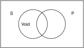

  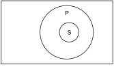

- 所有的S都不是P

  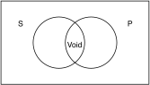

  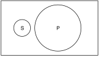

- 有的S是P

  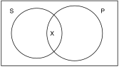

  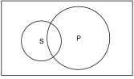

  

- 有的S不是P

  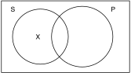

  

#### 8.1.2转换成标准形式

- “只有白天放映的电影才是半价的。”

  “半价电影仅限于白天放映的。”

  “所有半价电影的都是白天放映的。”

8.1.3对当方阵

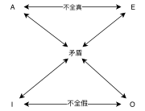

### 8.2 三种关于直言判断的运算

#### 8.2.1换位

- 对于EI判断，换位SP后，判断值不变
- 对于AO判断，换位SP后，判断值不等

#### 8.2.2换质

- 换质
  1. 把它从肯定判断变成否定判断

  2. 把谓项变成原判断谓项的补词项

- AEIO判断换质前后判断是相互等值的

- 例子

  - A判断：所有的长老会教友都是基督教徒

    换质：没有长老会教友是非基督教徒

  - E判断：没有鱼是哺乳动物

    换质：所有的鱼都是非哺乳动物

8.2.3换质位

- 换质位

  1. 调换主项和谓项的位置
  2. 分别用补词代替元判断的词项

- 例子

  - A判断：所有的蒙古人都是穆斯林

    换质位：所有的非穆斯林都是非蒙古人

  - O判断：有的市民不是选民

    换质位：有的非选民不是非市民

- AO判断在换质位前后是等值的，但EI判断换质位前后不等值

### 8.3 直言三段论

- 由三个标准的直言判断构成的三段论，并且这三个判断中包含三个词项，每个词项都正好出现两次

- 例子

  - 所有的**美国人**都是**消费者**

    有的**消费者**不是**民主党人**

    因此，有的**美国人**不是**民主党人**

  - 大项（P）：民主党人

    中项（M）：消费者

    小项（S）：美国人

#### 8.3.1使用Venn图检验三段论

- 举例

  所有的P都是M

  有的S是M

  有的S是P

  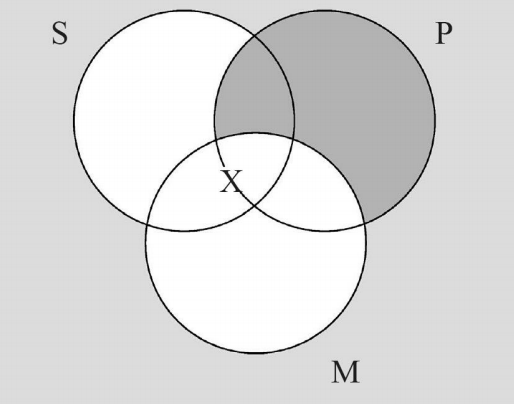

#### 8.3.2含有未表达前提的直言三段论

- “你不应该把鸡骨头丢给狗。它们会卡住狗的喉咙的。”

  所有的鸡骨头都是会卡住狗喉咙的东西

  **会卡住狗喉咙的东西不是你该给狗的东西**

  因此，鸡骨头不是你该给狗的东西

#### 8.3.3实际生活中的三段论

- 举例：C$=$鸡骨头；D$=$卡住狗的东西；S$=$不该给狗的东西

  所有的C都是D

  所有D都是S

  所以，所有C都是S、

- 常见无效论证

  | 前提1        | 前提2    | 结论         |
  | ------------ | -------- | ------------ |
  | 所有的A都是X | 没有A是Y | 没有X是Y     |
  | 所有的X都是Y |          | 所有的Y都是X |
  | 有的X不是Y   |          | 有的Y不是X   |
  | 有的X是Y     |          | 有的X不是Y   |
  | 有的X不是Y   |          | 有的X是Y     |

#### 8.3.4用规则检验三段论的有效性

- 周延

  该判断是否陈述了某类词项的每个成员

- 周延的项

  | 类型  | 描述                 |
  | ----- | -------------------- |
  | A判断 | 所有的**S**都是P     |
  | E判断 | 所有**S**都不是**P** |
  | I判断 | 有的S是P             |
  | O判断 | 有的S不是**P**       |

- 检验三段论有效的三条规则

  1. 前提中的否定判断数量必须和结论中的否定判断数量一样（那么一个有效三段论不会有两个否定的前提）
  2. 中项在前提中至少周延一次
  3. 任何在结论中周延的词项必须在前提中也是周延的

## 第九章 演绎论②：真值函数逻辑

### 9.1真值表和真值函数符号

#### 9.1.1判断变元

- 并非、并且、或者
- 判断变元：第八章中，大写字母表示词项。但在这里，大写字母表示判断（陈述句）。

#### 9.1.2真值表

- 否定判断
  
  | P    | ~P   |
  | ---- | ---- |
| T    | F    |
  | F    | T    |
  
- 合取\析取判断

  | P    | Q    | P&Q | P$\or$Q |
  | ---- | ---- | -------- | ------- |
  | T    | T    | T        | T       |
  | T    | F    | F        | T       |
  | F    | T    | F        | T       |
  | F    | F    | F        | T       |

- 假言判断

  | P    | Q    | P$\rightarrow$Q |
  | ---- | ---- | --------------- |
  | T    | T    | T               |
  | T    | F    | F               |
  | F    | T    | T               |
  | F    | F    | T               |

### 9.2用符号表示复合判断

- 假言判断最难进行真值函数的判断

- 假言判断的骗局

  你完全可以赢取

  100000000000美元

  如果你遵循指导并交回中奖号码！

  P&Q $\rightarrow$ Z
  
  如果号码没有中奖，那么Q为假，P&Q为假，Z无论为任何值，假言判断都为真。因而具有狡辩的余地。

#### 9.2.2必要和充分条件

- X是Y的必要条件：Y$\rightarrow$X
  - 引起燃烧（C）必须要有氧气存在（O）

    C $\rightarrow$ O

- X是Y的充分条件：X$\rightarrow$Y

  - 如果黄西出生于美国（A），那么黄西是美国公民（C）

    A$\rightarrow$C

### 9.2.3“除非”

- 波拉将取消赎回权（P），除非昆西付清全款（Q）

  ~Q$\rightarrow$P

  P$\or$Q

#### 9.2.4“或者……，或者……”

- 或者P和Q，或者R

  （P&Q)$\or$R

- P且或者Q或者R

  P&(Q$\or$R)

### 9.3真值函数论证模式（简略版）

#### 9.3.1三种常见的有效论证模式

| 论证模式             | 前提1                      | 前提2        | 结论         |
| -------------------- | -------------------------- | ------------ | ------------ |
| 肯定前件式           | 如果P，那么Q               | P            | Q            |
| 否定后件式（归谬法） | 如果P，那么Q(仅当Q，才会P) | ~Q           | ~P           |
| 假言连锁论证         | 如果P，那么Q               | 如果Q，那么R | 如果P，那么R |

#### 9.3.2三种谬误：无效的论证模式

| 谬误                   | 前提1        | 前提2        | 结论         |
| ---------------------- | ------------ | ------------ | ------------ |
| 肯定后件式             | 如果P，那么Q | Q            | P            |
| 否定前件式             | 如果P，那么Q | ~P           | ~Q           |
| 貌似假言连锁的错误论证 | 如果P，那么Q | 如果R，那么Q | 如果P，那么R |

### 9.4真值函数的论证

- 直言三段论共有256种形式（Why？）
- 有效论证（见第[2.2.1](#2.2.1演绎论证)）

#### 9.4.1真值表法

- 画出真值表以寻找反例

#### 9.4.2简化真值表法

- P$\rightarrow$Q

  ~Q$\rightarrow$R

  ~P$\rightarrow$R

  倒推：若前件为真且后件为假，则结论为假

### 9.5演绎

#### 9.5.1第一组规则：有效论证的基本模式

1. 分离规则（Modus Ponens，MP）（肯定前件式）

2. 否定后件式（Modus Tollens MT）

3. 连锁论证式（CA）

4. 析取论证式（DA）

   P$\or$Q

   ~P

   Q

5. 合取分解式（SIM）

   P&Q

   P

6. 合取合成式（CONJ）

   P

   Q

   P&Q

7. 析取附加式（ADD）

   P

   P$\or$Q

8. 二难推理的构成式（CD）

   P$\rightarrow$Q

   R$\rightarrow$S

   P$\or$R

   Q$\or$S

9. 二难推理的破坏式

   P->Q

   R->S

   ~Q$\or$~S

   ~P$\or$~R

#### 9.5.2第二组规则：真值函数的等值式

- “律”

  $\Leftrightarrow$

10. 双重否定律（DN）

    P

    $\Leftrightarrow$

    ~~P

11. 交换律（COM）

    P&Q $\Leftrightarrow$Q&P

    P$\or$Q $\Leftrightarrow$Q$\or$P

12. 蕴含析取律（IMPL）

    (P$\rightarrow$Q)$\Leftrightarrow$(~P$\or$Q)

13. 假言异位律（CONTR）

    (P$\rightarrow$Q)$\Leftrightarrow$(~Q$\rightarrow$~P)

14. 徳摩根定律（DEM）

    ~(P&Q)$\Leftrightarrow$~P$\or$~Q

    ~(P$\or$Q)$\Leftrightarrow$~P&~Q

15. 条件移出律（EXP）

    [P$\rightarrow$(Q$\rightarrow$R)]$\Leftrightarrow$[P&Q$\rightarrow$R]

16. 结合律（ASSOC）

    (P&Q)&R$\Leftrightarrow$P&(Q&R)

17. 分配率（DIST）

18. 重言式（TAUT）

#### 9.5.3条件证明

- Conditional Proof, CP

  “如果P为真，那么Q也为真”，为了证明他，需要假设P为真

- 规定

  1. CP只能用于推断出假言判断，在消去CP的前提以后，接下来的一步必须是假言判断。
  2. 如果不止一次引入CP前提，需要按引入假设相反的顺序依次消去
  3. 一旦一个CP前提被消去，从该前提推导出的任何步骤都不可以再用于演绎推理
  4. 所有CP前提都必须被消去

第十章 关于非演绎推理的批判性思维

- 关注论证的相对强度，而非结论为真的可能性大小

  （A）约克是一名教师，所以，约克是民主党。
  （B）约克戴眼镜，所以，约克是民主党。

  一般认为，在没有其他背景知识的情况下，（A）的论证强度高于（B）

### 10.1 从一般到特殊的推理（统计三段论）

- 例子

  大多数教师是民主党人

  约克是教师

  所以约克是民主党人

- 置信水平

  约90%的教师是民主党人

  约克是教师

  所以约克是民主党

10.2 从特殊到一般的论证（基于样本的归纳概括）

- 民意测验、样本

- 理想的样本应该准确地代表总体

  - 随机抽样

  - 误差幅度

    样本间随机变异的范围

  - 置信水平

    样本落在给定误差幅度内的概率大小

- 样本越大，误差幅度越小

- 日常生活中

  - 少见精心选择样本
  - 少见精确计算可能性大小

### 10.3从特殊到特殊的推理：基于类比的非演绎论证

#### 10.3.1基于类比的非演绎论证的运作方式

- 逻辑

  X和Y都具有属性p，q，r（等等）

  X具有特征I

  所以Y也有特征I

- 我们关心论证的相对强度，而非结论的对错

- 指南

  1. 类比之间的相似性越多、越广泛，论证越强
  2. 对于我们关心的属性而言，各相似性或差异性之间存在着联系程度的不同
  3. 相反类似项越少，论证越强；相反类似项越多，论证越弱

- 评价类比推理并不是精确的科学。试图机械地利用公式来评价类比推理并不明智

#### 10.3.2类比的其他用途

- 用于解释、修辞等
- 熊和熊市
- 用于反驳论证的逻辑类比

### 10.4从一般到一般的类比

- 错误推理的实例
  大多数患有前列腺癌的人PSA水平都高
  所以，大多数PSA水平高的人都有前列腺癌
- 大多数肺癌患者都吸烟，所以，大多数吸烟者都患有肺癌
- 交通事故的肇事者中极少数是90高龄的醉驾者，所以，90高龄的醉驾者中极少出交通事故

### 10.5误差幅度和置信水平的日常提示词

- 毫无疑问
  我愿意下任何赌注
  几乎可以确定
  可能性极高
  很可能
  有可能
  一半可能
  不排除
  也许
  不大可能
  绝不可能

  ……

- 大约
  左右
  近似
  多数
  许多

  ……

  

### 10.6非演绎推理中的谬误及相关问题

#### 10.6.1仓促概括

- 基于太小的样本（相对其所代表的总体）所做的概括推理

#### 10.6.2传闻证据

- 样本来自于传闻，来源不明
- 传闻往往在心理上引人入胜
- 但也不过只是一个样本而已

#### 10.6.3以偏概全

- 高估基于片面样本的论证强度

#### 10.6.4自荐样本的谬误

- 样本自告奋勇的成为样本
  - 电话访谈
  - 选秀节目
  - 接头采访
- 60%的反馈者喜欢奥巴马（反馈者是自荐）

#### 10.6.5有倾向性的问题

- 一件事情，不同立场
  - 您认为校董应该同意教师们提出的更高报酬的要求吗？
  - 您认为公立学校的教师要求提高待遇是合理的吗？
- 民意调查中含有带倾向性的问题往往不是无意而为的，具有欺骗性
- 并不罕见

#### 10.6.6弱类比

- 对通过类比所得到的结论给予过高的估计

- 例子

  我邻居的比特狗攻击性很强，所以，你准备领养的比特狗~~也会富于攻击性~~

  我邻居的比特狗攻击性很强，所以，你准备领养的比特狗**也可能会有这个问题**

#### 10.6.7模糊的概念

- 性陈述过于模糊以至于需要具体理解时却无法知道它所表达的意义

- 华丽概述（Glowing Generality）

  - 模糊的概述与积极意义联系在一起
  - 政治、广告、演讲

  除了表明表达者的态度之外，并没有提供任何实质信息

## 第十一章 因果解释

- 解释与论证不同

  - 论证支持或证明某个命题

  - 解释阐明某事

    这是如何发生的，怎样发生的，它是怎样起作用的，它用来做什么，将要发生什么，它是怎么变成这样的，可以做些什么，为什么不做点什么等

  - 二者往往混淆

  - 其根源之一是用于解释某事的语句也可用作论证的前提或结论

### 11.1两种解释

#### 11.1.1物理因果解释

我们的车怎么爆胎了？
地板上的积水是什么引起的？
火箭为什么会爆炸？
我怎么患有高血压？
今年为什么这么多雪？
什么引起全球变暖？
为什么恐龙会灭绝？

#### 11.1.2行为因果解释

为什么工会投票同意这个合同？
为什么鲍克米泽否决该法案？
为什么施瓦辛格不试图平衡预算？
为什么南部各州都支持共和党？
为什么带英格兰口音的男管家报酬较高？
何以解释短信越来越流行？
为什么布兰妮·斯皮尔斯如此引人关注？
引起人类战争的原因是什么？

### 11.2充分解释：一个相对的概念

- 有用
  - 不自相矛盾
  - 不含混
  - 不模棱两可
  - 不与背景知识冲突
  - 不会导致错误的预测

#### 11.2.1至关重要的可检验性

- 预测

#### 11.2.2无法检验的解释

- 前世造孽的人今生苦难

#### 11.2.3循环解释

- 简单的重述待解释的现象

#### 11.2.4不必要的复杂性

- 避免不必要的假设或其他不必要的复杂性

### 11.3形成假说

- 形成假说的四种方法

#### 11.3.1求异法

- 寻找不寻常事件的原因
- 例子：全球变暖

#### 11.3.2求同法

- 如果在多个场合出现的某种结果都伴随着相互关联的现象或者总是与另一现象之间共同变化，那么
  就认为二者之间可能有因果联系。
- 把任何相关或共变都视为因果是一种错误，即“共同变化，是为因果”谬误

#### 11.3.3因果机制和背景知识

- 在形成因果假说时，为了将可能的因果联系减少至可控的范围之内，人们要依赖于关于因果联系的背景知识

#### 11.3.4最佳诊断方法

- 寻求最佳解释
- 区别于求异法求同法
- 背景知识往往是指引

### 11.4普遍的因果陈述

- 非具体的因果事件

### 11.5验证因果假说

#### 11.5.1对照的因果实验

- 实验组和对照组
- 重复试验减少巧合的可能性

#### 11.5.2避免在人群中检验因果假说的替代方法

- 避免在人身上实验

#### 11.5.3非实验的因果研究

- 检验肥胖是否导致心脏病
  - 肥胖人一组
  - 正常人一组

#### 11.5.4非实验的因果研究

- 检验肥胖是否导致心脏病
  - 心脏病人一组
  - 正常人一组

#### 11.5.5在动物身上进行实验

#### 11.6因果推理中的错误

- 过度复杂的
- 与已知事实或理论不相容的
- 模糊、歧义或循环的
- 由于其他原因不可检验的
- 在此之后，因是之故
- 共同变化，是为因果

#### 11.6.1体检中的混淆因果

> 10人会患膀胱癌
> 这10人中有9人体检呈阳性
> 990人不会患膀胱癌
> 这990人中99人体检呈阳性

- 朴素贝叶斯

#### 11.6.2忽视统计回归

- “统计回归”和“均值回归”指在测量总体的平均值时体现的统计特性
- 读数异常转正常，也许只是回归

#### 11.6.3缺乏否证，所以得证

- 缺乏否证并没有为证实假说提供任何新的理由

#### 11.6.4诉诸传闻

- 过基于传闻证据进行概括的错误

#### 11.6.5混淆解释和辩解

- 如果你不假思索地认为试图解释错误行为的原因就是为其辩解，那就犯了我们称作混淆解释和辩解（Confusing Explanations With Excuses）的错误
- 解释德国为什么选出希特勒并不是为纳粹辩解

### 11.7法律上的因果联系

- 法律原因讲究“近因”

- 为了让某人对发生的损害承担法律责任，就必须先证明该主体的行为导致了特定的损害

- 肯定后件式和最佳解释推理

  很多时候，一些类似肯定后件式的谬误的推理可以宽容的认为是最佳解释推理

  - 如果增兵成功，那么巴格达的暴力事件会减少

    暴力事件减少了

    增兵成功了

## 第十二章 道德、法律与美学推理

#### 12.1价值判断

- “规范性”陈述
- 并不是所有的价值判断都是道德价值判断
  - 评价一部电影很棒
- 一个并不是价值判断的命题中或许隐含着价值判断
  - 大卫$\cdot$艾索洛，很优秀的人，策划过奥巴马总统的竞选

#### 12.1.1 道德与非道德

- 对“道德”的理解
  - “非道德”的反义词
  - “不道德”的反义词

#### 12.1.2道德推理的两个原则

1. 一致性原则：同样的个案必须同等对待，同等对待的个案必须情况相同

2. 看起来违背了一致性原则的一方有责任证明他并没有违背一致性原则

#### 12.1.3 道德原则

- 道德原则是普遍意义上的价值判断
- 普遍性、一般性、非个体

#### 12.1.4形成特定的道德价值判断

- 前提陈述事实而结论得出道德价值判断的道德推理都含有一个道德原则作为假设

### 12.2 道德推理中的主要视角

- 讨论的是西方思想中特别有影响力的思考视角

#### 12.2.1 后果论

- 功利主义
  - 从正反两面考虑后果，并选择使快乐最大化的那个方案
- 伦理学的利己主义
  - 只考虑自我快乐值
- 伦理学上的利他主义
  - 只考虑他人快乐值

#### 12.2.2 义务论/道义论

- 康德认为，道德命令是无条件的或绝对的：它所规定的行为，不是为了某种结果，而是因为该行为就是我们道德上的责任
- 纯粹因为它是道德上的义务而实施的行为
- 决不把他人当做手段的道德必要性

#### 12.2.3 道德相对主义

- 正确或错误依赖并决定于其所处的群体或文化

- 两个相混淆的观点

  1. 对行为正确和错误所持的信念，可能会在不同群体、不同社会或不同文化间呈现
     差异。
  2. 行事方式到底是正确还是错误，可能会因不同群体、不同社会、不同文化而呈现
     差异。

  第一个观点是无可争议的，但第二个观点存争议

- 三个潜在难题

  1. 到底如何界定群体、社会和文化？界定其全体成员的标准是什么？特定的人到底可以归属于哪些群体、社会或文化？
  2. 某一群体的成员中所接受的道德原则往往是相互冲突的。例如，即使在一个很小的社区，其居民之间对同性恋所持的态度往往也是不一致的。
  3. 同事置身于多个群体会使自身产生自相矛盾的标准

#### 12.2.4 宗教相对主义

- 行为的正确和错误决定于一个人所处的宗教文化或社会

#### 12.2.5宗教绝对主义

- 正确的道德原则就是“正确”的宗教所接受的原则

#### 12.2.6 德性伦理

- 它关注的不是做什么，而是成为什么样的人
- 道德困境：并不能明确无误地确定品性良好的人会如何采取行动

### 12.3道德慎思

- 视角不同所带来的分分歧

### 12.4法律推理

- 区分两类问题

  1. 在个案中适用法律及解释法律

  2. 法律应该是什么

- 诉诸先例在法律推理中的特殊地位

- 四个视角

  法律禁止X，一般视角是：

  1. X不道德
  2. 伤害原则：X对别人造成了伤害
  3. 法律家长主义：法律阻止某人做有害自我的事情
  4. 冒犯性原则：X对他人具有冒犯性

### 12.5美学推理

- 美学思考依赖于将事实与价值融为一体的概念框架

#### 12.5.1八个美学原则

1. 含义深远或启迪真理的对象具有美学价值

   （很多人认为艺术向我们揭示真理，而这些真理通常被我们日常生活的实际想法所掩蔽）

2. 能够表达其文化或传统的核心价值或信念的对象具有美学价值

3. 有助于带来社会或政治变革的对象具有美学价值

   （《汤姆叔叔的小屋》有助于反奴隶制运动，该运动导致了美国内战）

4. .能使体验或欣赏的人感到快乐的对象具有美学价值

5. 能够给人带来有价值的情感的对象具有美学价值

6. 能够带来特定的非情绪性的体验的对象具有美学价值

7. 拥有某种美学特性或展现特殊美学形式的对象具有美学价值

8. .对象是否具有美学价值无法给出论证的理由

#### 12.5.2 用美学原则来判断美学价值

- 一些原则在评判美学价值时并不总能一致地采用
- 即同一个原则能产生积极的评价，也能产生消极的
  评价

#### 12.5.3 评价美学评论：相关性与真实性

- 区分美学评论的良莠之分
  1. 特定的艺术评论中都采纳了美学原则作为思考框架，基于特定的原则，评论的
     理由就有相关和不相关的区分
  2. 即使理由是相关的，如果将原则运用于作品时有失真实，依然不是好的评论

#### 12.5.4 为什么进行美学推理

- 美学原则的来源
  1. 美学原则是定义。这就是说，这些原则为我们提供了美学词汇，来指导我们识别一个物品的美学价值
  2. 美学原则是概括，它总结了把对象视为有价值的艺术品的真实体验。其中的论证是从样本到目标的类比

  两种来源相互补充

- 艺术的原则充当指南，指导着我们给作品以适当的好评或批评。

- 所以，美学推理含有这样的叙述，它**激发**人们以**特定的方式**感知对象的特质。这些规定性的观察方式激起好评（或批评）的反应或体验

- 美学判断基于对作品的感知共识

